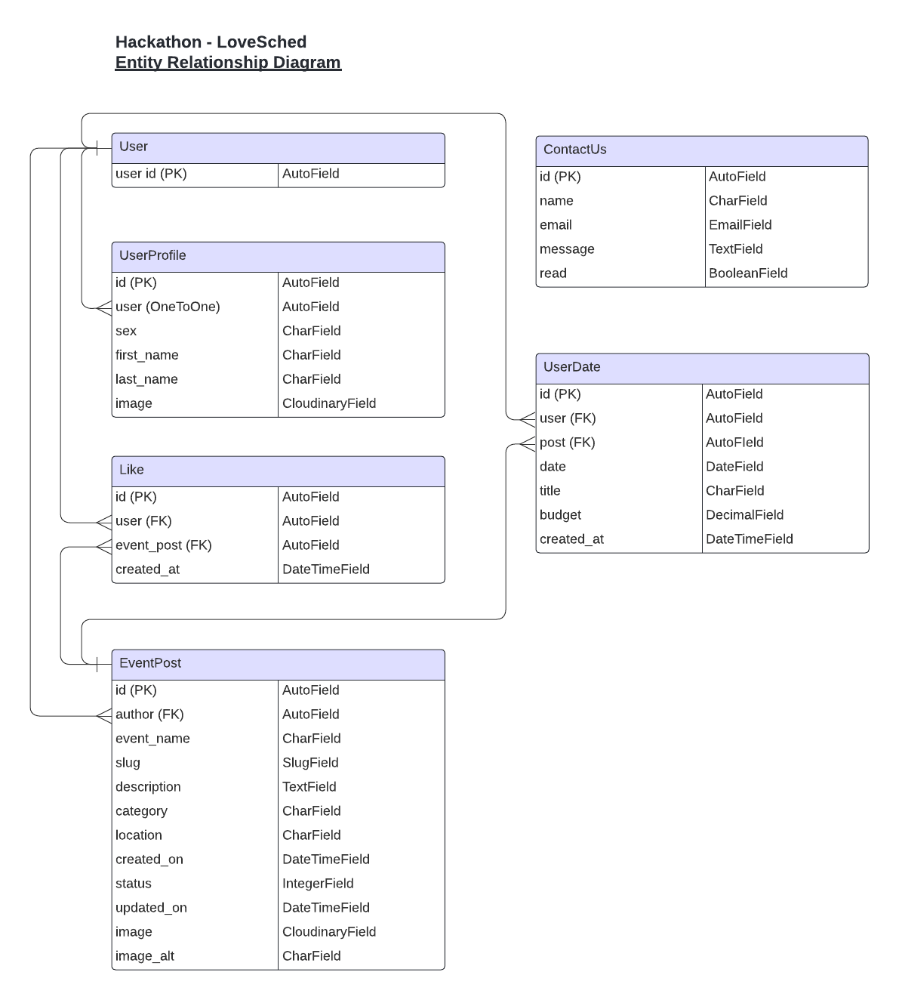
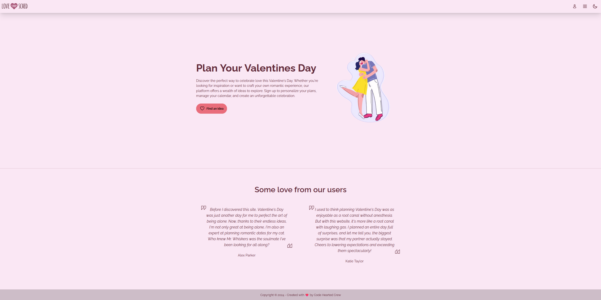
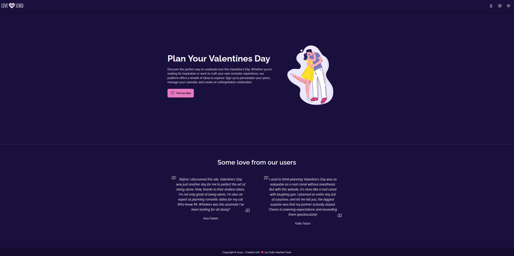
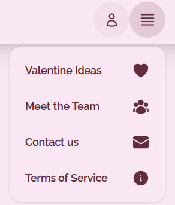
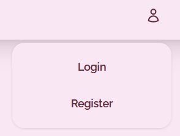
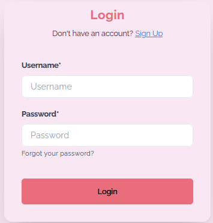
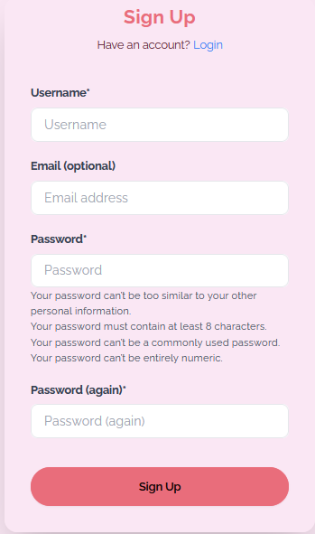
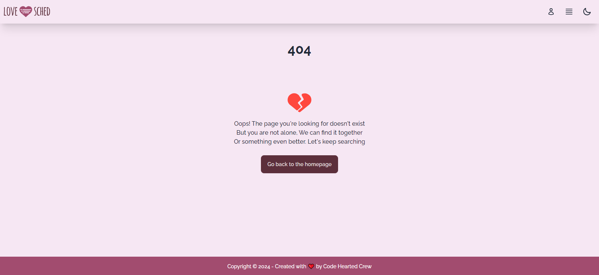
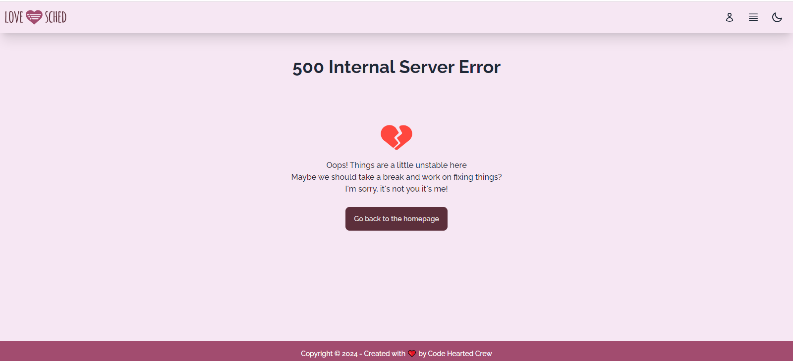

<h1 align= "center"><strong>❤️🗓 Love Sched | February Hackathon 2024 ❤️ </strong></h1>

[Click for live view](https://lovesched-team5-0bc1fe06d0da.herokuapp.com/)

<!-- The website picture here -->

# Love Sched
Welcome to Love Sched. An events ideas and date planner for all your romantic needs. 
Brought to you by the [**Code Hearted Crew**](#code-hearted-crew)

## Table of Contents
* [**Planning and Development**](#planning-and-development)
    * [***Target Users***](#target-users)
    * [***User Stories***](#user-stories)
    * [***Site Objectives***](#site-objectives)
    * [***Research***](#research)
    * [***Wireframes***](#wireframes)
    * [***Database Schema***](#database-schema)
    * [***Colour Scheme***](#colour-scheme)
    * [***Typography***](#typography)
* [**Features**](#features)
* [**Future Features**](#future-features)
* [**Testing**](#testing)
* [**Deployment**](#deployment)
* [**Languages**](#languages)
* [**Frameworks and Software**](#frameworks-and-software)
* [**Code Hearted Crew Team**](#code-hearted-crew)

## 🧑‍💻Planning and Development

### Target Users
- Couples looking for fresh and innovative date ideas to keep their relationship vibrant and exciting.
- Individuals planning a special romantic gesture or surprise for their partner, seeking expert guidance and execution.
- Partners celebrating significant milestones such as anniversaries, birthdays, or simply wanting to enrich their day-to-day romantic life.
- New relationships aiming to establish a strong foundation through shared experiences and quality time.
- Users seeking fresh, innovative ideas for their romantic events, aiming to enrich their celebrations with unique and memorable experiences.

### User stories

#### First Time Visitor Goal

  - I want to find out if I can access romantic event ideas and plan dates through Love Sched
  - I want to easily navigate the site and access different parts of the platform.
  - I want compatibility with various devices for seamless browsing.

#### As a user interested in Valentine's ideas

  - I want the site to provide a dedicated section for Valentine's Day, offering unique and creative date and gift ideas to celebrate the occasion.

#### Returning Visitor Goal

  - I want to discover new features or improvements made to the Love Sched platform.
  - I want to explore the latest trends in date planning.

#### Frequent Visitor Goal

  - I want to easily recommend Love Sched to friends, highlighting its effectiveness in enhancing romantic relationships through thoughtful and well-planned events.

#### As a differently-abled user

  - I want the product to be accessible, with features and designs that accommodate a wide range of disabilities, ensuring everyone can plan and enjoy romantic events.

### Site Objectives

#### Enhance Romantic Connections: 
  - Provide couples with creative ideas and planning tools for unforgettable romantic experiences, fostering deeper relationships.

#### One-Stop Romance Planning Guide: 
  -  A complete resource for planning dates and romantic events, offering ideas tailored to a wide range of preferences and budgets.

### Website Structure

#### Landing Page:
    - Introduces LoveSched's mission and button to view events.
#### Dark Mode Button:
    - Allows users to switch the website's appearance to dark mode.
#### Login/Registration Page:
    - Allows users to Login or Sign Up.

#### Menu:

#### Valentine Ideas Page:
    - A dedicated section for Valentine's Day, featuring unique and creative ideas for dates and gifts, helping users celebrate the occasion in memorable ways.

#### Meet the Team Page: 
    - Shares insights into LoveSched's team.

#### Contact us Page:
    - Offers straightforward access for users to reach out for support.

#### Terms of Service:
    - Our Terms of Service outline simple rules and guidelines to ensure a smooth experience, covering user conduct and privacy.


### Research
The following sites were discussed as inspiration.
- [Design Calendar](https://www.designcalendar.io/events)
- [Art-party/events](https://sv.art-party.se/events)
- [Metmuseum](https://www.metmuseum.org/events/whats-on)
- [Evvnt](https://evvnt.com/)

[**Back to top**](#love-sched)

### Wireframes
- 
- ...
- ...

### Database Schema
Pre-project planning involved generating an entity relationship diagram. This was done in order to create a clear plan as to how all of the database models interact with each other. This was also done to determine what data fields were needed for each model. The relationship between each model and another is noted in the diagram with "FK" denoting Foreign Key. A One To One relationship exists between the User model and the UserProfile model.
<details><summary>Entity Relationship Diagram</summary>

</details>

### 🖌️Colour Scheme


### Typography

- #### Fonts
    - Our choice of font was [Raleway ](https://fonts.google.com/specimen/Raleway?utm_source=fontsNinja&utm_medium=browserExtension&utm_campaign=foundryLinkAction).This font choice was imported from [Google Fonts](https://fonts.google.com/).


## Features

### Fully responsive
- This site adapts to all devices and screen sizes ranging between 320px - ###px wide.

### Light & Dark modes
- Users can toggle between light and dark mode to suit their visual preferences. 
<details><summary>Screenshots</summary>



_Light/Dark_

</details> 

### Menu
- The navbar shows Valentine Ideas, Meet the Team,Contact us and Terms of Service
<details><summary>Screenshots</summary>



_Menu_

</details>

### Login/Register
 - Allows users to Login or Sign Up.
<details><summary>Screenshots</summary>




_Login/Register_

</details>

### Footer
<details><summary>Screenshots</summary>


_Footer_
</details>

### Error Pages
- Custom 403, 404 and 500 error pages included which contain a button to take the user back to the homepage.
<details><summary>404</summary>

</details>
<details><summary>500</summary>

</details>

## Future Features
- Comments are planned as a future feature to enhance the cleanliness and organization of the ideas page, pending the implementation of a comment approval process.
- ...

## 🧮Testing
- Please see full documentation for testing and bug reports [here](testing.md)

## ⚙️Deployment
### Dependencies
The dependencies required for this project can be found in the `requirements.txt` file located in project's root directory. The dependencies need to be installed by running `pip install -r requirements.txt` in your command line when you are in the project's root directory.

```
asgiref==3.7.2
cloudinary==1.38.0
crispy-tailwind==1.0.3
dj-database-url==0.5.0
dj3-cloudinary-storage==0.0.6
Django==5.0.2
django-allauth==0.61.1
django-crispy-forms==2.1
gunicorn==21.2.0
oauthlib==3.2.2
pillow==10.2.0
psycopg2==2.9.9
PyJWT==2.8.0
python-dotenv==1.0.1
python3-openid==3.2.0
requests-oauthlib==1.3.1
sqlparse==0.4.4
tzdata==2024.1
urllib3==1.26.15
```

### Project Deployment: Heroku

This project was deployed using Heroku and the live site can be visited [here](https://lovesched-team5-0bc1fe06d0da.herokuapp.com/). The following steps were taken to do so:

#### 1. **Initial Setup on Heroku:**

* Sign up or log in to [Heroku](https://www.heroku.com/).

* On the main Heroku Dashboard, click 'New' > 'Create New App'.
* Name your project (e.g., `lovesched-team5`). Remember, the app name must be unique.
* Choose a suitable region and then click 'Create app'.

#### 2. **Setting Up the Database:**

* Navigate to the 'Resources' tab from the submenu.

* In the 'Add-ons' section, search for 'Heroku Postgres'.
* Select and add 'Heroku Postgres' as the database.
* Go to the 'Settings' tab, and within the 'Config Vars' section, copy the `DATABASE_URL` for later use.

#### 3. **Configuring Django App for Heroku:**

* In your Django app repository, create a new file named `env.py`.
  * Import the `os` library.
  * Set the environment variable for `DATABASE_URL` (paste the address copied from Heroku).
  * Add a secret key: `os.environ["SECRET_KEY"] = "your_secret_key"`.

* Back in Heroku, add the secret key you just created to the 'Config Vars' (KEY: `SECRET_KEY`, VALUE: your secret key).
* Modify the `settings.py` in your Django app:
  * Import necessary libraries (`Path`, `os`, `dj_database_url`).
  * Use `if os.path.isfile("env.py"): import env`.
  * Replace the default secret key with `SECRET_KEY = os.environ.get('SECRET_KEY')`.
  * Update the databases section to connect to the Heroku Postgres: `DATABASES = {'default': dj_database_url.parse(os.environ.get("DATABASE_URL"))}`.
  * Migrate models to the new database using the terminal.

#### 4. **Setting Up Cloudinary:**

* Visit [Cloudinary](https://cloudinary.com/) and either sign in or create an account.

* Copy the `CLOUDINARY_URL` from the dashboard.
* In the `env.py` file, add `os.environ["CLOUDINARY_URL"] = "copied_url"`.
* Add the `CLOUDINARY_URL` to the Heroku 'Config Vars'.
* Add `DISABLE_COLLECTSTATIC` with value `1` to the 'Config Vars' (this should be removed before final deployment).
* Modify `settings.py` to configure Cloudinary:
  * Add the Cloudinary libraries to `INSTALLED_APPS` (order matters: `'cloudinary_storage'` above `'django.contrib.staticfiles'` and `'cloudinary'` below).
  * Define STATIC files settings (URL, storage path, directory path, root path, media URL, and default file storage path).

#### 5. **Final Configurations:**

* Link your templates directory in Heroku: `TEMPLATES_DIR = os.path.join(BASE_DIR, 'templates')`.

* Update the templates directory to `TEMPLATES_DIR`: `'DIRS': [TEMPLATES_DIR]`.
* Add your Heroku app to `ALLOWED_HOSTS` (format: `app_name.herokuapp.com`).
* Create three top-level directories in your project: `media`, `static`, `templates`.
* Add a `Procfile` at the top level and write: `web: gunicorn PROJECT_NAME.wsgi`.
* Commit and push your changes to GitHub.

#### 6. **Deploy on Heroku:**

* In Heroku, go to the 'Deploy' tab.

* Deploy the branch manually and monitor the build logs for any issues.
* Once the build completes, you'll see a success message and a link to view the live site.

Remember to replace placeholders like `your_secret_key`, `copied_url`, and `PROJECT_NAME` with actual values relevant to your project.

### Forking the Repository
Forking the GitHub Repository allows you to have a copy of the original repository. This enables you to view or make changes without affecting the original content.

To fork the repository:

1. Log into [GitHub](https://github.com/) or create an account.
2. Navigate to the repository: [team5-feb-hackathon](https://github.com/kpetrauskas92/team5-feb-hackathon)
3. Find the 'Fork' button to create a new fork
4. When creating the fork, the name and description can be changed
5. Click 'Create fork'

### Clone a Repository
1. Go to the repository you want to clone
2. Click 'code' and copy the URL
3. Open a new workspace in your IDE
4. In a new terminal use the command '$ git clone [your-fork-repository-url]'
5. Create an Upstream branch to be able to sync with main version of the project
6. Use command '$ git remote add upstream [main-repository-url]'
7. To sync, use commands '$ git fetch upstream' and '$ git merge upstream/main'

## 🤖Technologies Used

## Languages
- [HTML](https://developer.mozilla.org/en-US/docs/Web/HTML)
- [CSS](https://developer.mozilla.org/en-US/docs/Web/css)
- [JavaScript](https://pythontutor.com/javascript.html#mode=edit)
- [Python](https://www.python.org/)
- [Django](https://www.djangoproject.com/)

### Frameworks and Software
- [Git](https://git-scm.com/)
- [GitHub](https://github.com/)
- [Git Pod](https://www.gitpod.io/)
- [VS Code](https://code.visualstudio.com/)
- [Font Awesome](https://fontawesome.com/)
- [Procreate](https://procreate.com/)
- [Tailwind CSS](https://tailwindcss.com/)
- [DaisyUi](https://daisyui.com/)
- [Lucid](https://lucid.co/)


## Credits
## Code Hearted Crew

### Karolis Petrauskas : Scrum Master https://www.linkedin.com/in/pkarolisdev/
### Declan Caulfield https://www.linkedin.com/in/declan-caulfield/
### Claire Fisher https://www.linkedin.com/in/claire-fisher-coder/
### Ann Edvinsson https://www.linkedin.com/in/ann-edvinsson/
### Yakiv Brychuk https://www.linkedin.com/in/yakiv-b-250831a4/
### Adam Kestell https://www.linkedin.com/in/adam-kestell/
